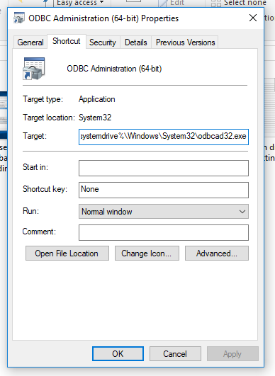
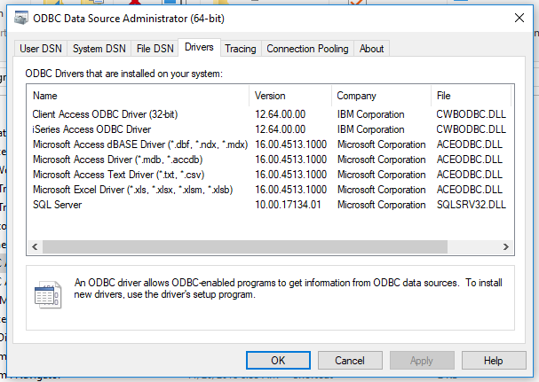
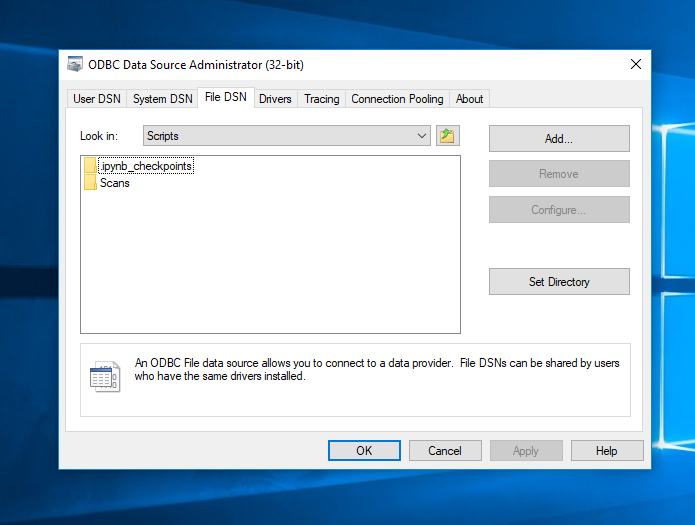
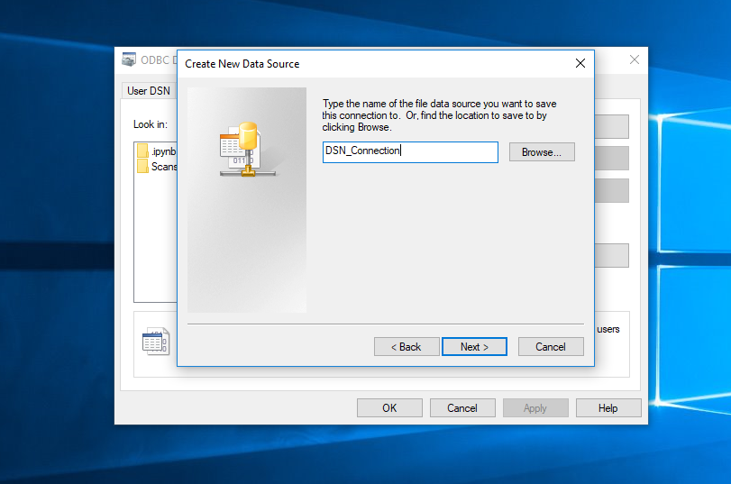
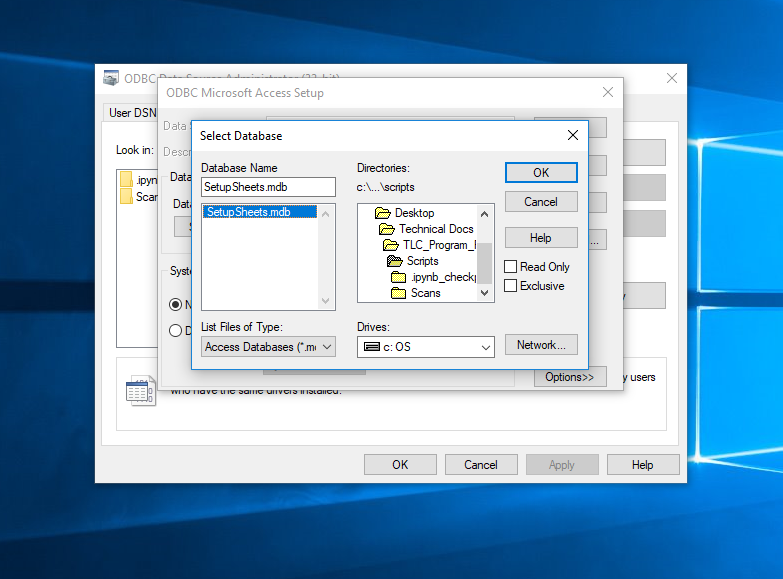

# Manipulating a MS Access database in Pythin, Pandas using PyODBC

## Purpose

Setting up and loading dependencies for Windows drivers, Python environment, and some sample code to interact with a Microsoft Acces .mdb database using Python. The directions below were performed on a Windows 10 machine, but I followed roughly the same steps to set it up on a Winodows 7 machine as well. The only steps that change are navagating to files / directories in Windows Explorer itself.

## Either 64 & 64 or 32 & 32

The first thing to note is the Python environment and the database __must__ be the same bitness.
This was a huge hangup for me in the beginning because I didn't realize my Anaconda was running 64 bit but my MS Office was 32. This will likely be the case for many people starting with default installations. For these directions, personally I decided to uninstall my MS Office and reinstall the 64 bit. Handling a lot of large data files, this makes sense since it's one of the benefits of 64 bit MS Office. You can find directions for downloading MS Office [here](https://support.office.com/en-us/article/download-and-install-or-reinstall-office-365-or-office-2019-on-a-pc-or-mac-4414eaaf-0478-48be-9c42-23adc4716658). If you'd rather not change your MS Office installation you can run a specific Python environment just for handling this module.

## Download PYODBC

If you're not using Anaconda (which comes with PYODBC preloaded), download the PYODBC module either from [here](https://pypi.org/project/pyodbc/#description) or by using 'pip install pyodbc'. 

## Windows Drivers

Another big hang up I had was although I had installed the 64 bit version of Microsoft Office, it did not come with the DSN drivers needed to interact with the data base. You can check the drivers that Python recognizes using the code below:

.png)

You should see .mdb and *accdb under Microsoft Access Driver, these correspond to the 64 bit Windows drivers needed. The solution for me to get the drivers installed was throught the 'Microsoft Access Database Engine 2016 Redistributable', you can download this package [here](https://www.microsoft.com/en-us/download/details.aspx?id=54920). Make sure you're downloading the 64 bit drivers.

## Setup the ODBC Data Source tool

In the start menu type 'ODBC' and right click on 'ODBC Administration (64 bit)' and press properties. We need to make sure we're looking at the correct ODBC, for 64 bit, and Windows doesn't do a great job of labeling these. The 64 but is actually under System32 directory. The 32 but is actually under the SysWoW64 directory. And to boot, both files are named odbcad32.exe - so don't let this fool you! You're root ('target') should look somoething like: 





Go ahead and hope up the ODBC Data Source Administrator (64-bit). If you're interested in navagating directory to the odbcad32.exe file I believe you can find it in Administrative Tools. Under the drivers tab you should see the same drivers listed as the step above when you checked in Python:





## Create the DSN File

This file will create a relationship between an ODBC interface and a database, pointing to where it should access. In the ODBC Data Source Administrator tool, go to the DSN File tab. I like to place that DSN file in the same directory as the .mdb I'll be accessing but I don't think this is necessary. Navigate to the directory you'd like to store the DSN file in and click 'Add':





In the next prompt select `Microsoft Access Driver (*.mdb, *.accdb)` from the list. We've already confirmed twice that this should be here. Next create a name for the DSN File, obviously something descriptive enough that in six months you'll realize what it is.





On the following screen press `select` next to `database` and nagivate to the location of your `.mdb` file. When in the correct directory you should see it populate on the left side of the window, select it an click ok. That's it for creating the DSN File.





## Formatting the DSN file

Another typical hang up adjusting the DSN file to match the requred Python syntax. Open the DSN file in a text / code editor like VS Code, Sublime, or Notepad++. It's going to look something like the code below:

```
[ODBC]
DRIVER=Microsoft Access Driver (*.mdb, *.accdb)
UID=admin
UserCommitSync=Yes
Threads=3
SafeTransactions=0
PageTimeout=5
MaxScanRows=8
MaxBufferSize=2048
FIL=MS Access
DriverId=25
DefaultDir=C:\Users\MacalusoC\Desktop\Technical Docs\TLC_Program_Release\Scripts
DBQ=C:\Users\MacalusoC\Desktop\Technical Docs\TLC_Program_Release\Scripts\SetupSheets.mdb
```

We need to format this into a single line to be fed as a variable into Python. Delete the initial `[ODBC]`. The beginning driver segment needs to be wrapping in curly braces and anything with a space in it needs parentheses. I also had to add escapes to my directories. Connect each line using a semi-colon. See the adjusted code below:

```
DRIVER={Microsoft Access Driver (*.mdb, *.accdb)};UID=admin;UserCommitSync=Yes;Threads=3;SafeTransactions=0;PageTimeout=5;MaxScanRows=8;MaxBufferSize=2048;FIL=(MS Access);DriverId=25;DefaultDir=(C:\\Users\\MacalusoC\\Desktop\\Technical Docs\\TLC_Program_Release\\Scripts);DBQ=C:\\Users\\MacalusoC\\Desktop\\Technical Docs\\TLC_Program_Release\\Scripts\\SetupSheets.mdb);
```


## Accesssing the .mdb in Python

Finally copy this same line of code you just adjusted, we're going to use it in Python as the directions for connecting with the `.mdb` database. Usually when testing chunks of code like this I find it easier to use Jupyter Notebooks or something like that, but use the environment of your choice.

Connect to the database:

```
import pyodbc

driver = 'DRIVER={Microsoft Access Driver (*.mdb, *.accdb)};UID=admin;UserCommitSync=Yes;Threads=3;SafeTransactions=0;PageTimeout=5;MaxScanRows=8;MaxBufferSize=2048;FIL=(MS Access);DriverId=25;DefaultDir=C:\\Users\\MacalusoC\\Desktop\\Technical Docs\\TLC_Program_Release\\Scripts;DBQ=C:\\Users\\MacalusoC\\Desktop\\Technical Docs\\TLC_Program_Release\\Scripts\\SetupSheets.mdb;'
con = pyodbc.connect(driver)
cursor = con.cursor()
```

Here's an example of pulling up specific columns from a table with a conditional value in one column:
```
var = 'abc'
cursor.execute("""SELECT <column_1>, <column_4>, <column_7> FROM <table_name> WHERE <condition_column> = ?""", (var))
```

To load this into a pandas dataframe:

```
access_table_data = pd.DataFrame.from_records(cursor.fetchall(),
                                          columns=[desc[0] for desc in
                                          cursor.description])
```